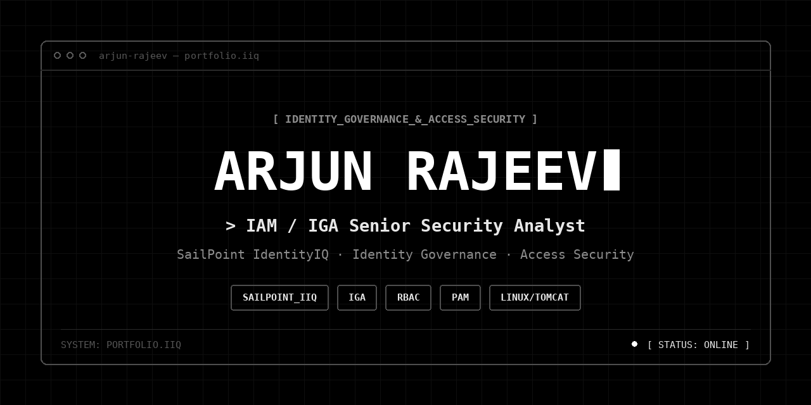

# arjun-rajeev

> IAM / IGA Senior Security Analyst — SailPoint IdentityIQ. Single-file, terminal-themed personal portfolio.

**Live site:** `https://arjunrajeev7.github.io/`

<a href="https://arjunrajeev7.github.io/">Link</a>



---

## Overview

A single-page portfolio built for an Identity & Access Management / Identity Governance security profile, styled as a black-and-white terminal — boot sequence on load, live CLI-style spinners, monospace typography throughout, and bracketed section labels (`[ ABOUT ]_`).

No build step, no dependencies to install. It's one static HTML file.

## Features

- **Boot sequence intro** — a typed terminal log (`mounting sailpoint iiq modules... [ok]`) plays once per page load, skippable by clicking anywhere, and automatically disabled for users with reduced-motion preferences enabled.
- **Live status console** — hero panel with CLI-style braille spinners simulating platform monitoring.
- **Fully responsive** — mobile nav collapses into a terminal-style dropdown.
- **Scroll reveal animations** via `IntersectionObserver`.
- **Sections:** About & Focus, Experience (timeline), Key Initiatives, Skills, Education & Achievements, Contact.

## Tech stack

| Layer | Choice |
|---|---|
| Markup | Semantic HTML5 |
| Styling | Vanilla CSS (Flexbox + Grid, CSS variables) |
| Fonts | [JetBrains Mono](https://fonts.google.com/specimen/JetBrains+Mono) (display), [IBM Plex Mono](https://fonts.google.com/specimen/IBM+Plex+Mono) (body) via Google Fonts CDN |
| Icons | [Font Awesome 6](https://fontawesome.com/) via CDN |
| JavaScript | Vanilla JS — no frameworks, no build tools |

## File structure

```
arjun-portfolio/
├── index.html      ← everything: markup, <style>, <script>
├── README.md
└── social-preview.png

```

`index.html` must stay at the **repo root** — GitHub Pages resolves the root `index.html` as the site's home page.

## Run locally

No build step required. Either:

```bash
# just open it
open index.html          # macOS
start index.html         # Windows
xdg-open index.html      # Linux
```

or serve it properly (recommended, avoids any local-file quirks):

```bash
python3 -m http.server 8000
# then visit http://localhost:8000
```

## Deploy with GitHub Pages

1. Push this repo to GitHub (public repo).
2. Go to **Settings → Pages**.
3. Under **Build and deployment**, set **Source** to `Deploy from a branch`.
4. Branch: `main`, folder: `/ (root)` → **Save**.
5. GitHub publishes the site at `https://<your-username>.github.io/<repo-name>/` within a minute or two.

## Customization

| What | Where |
|---|---|
| Name, role, bio | `<section class="hero">` |
| Work experience | `<section id="experience">` timeline items |
| Key initiatives | `<section id="initiatives">` cards |
| Skills | `<section id="skills">` pill groups |
| Certifications / education | `<section id="education">` |
| Contact links | `<section id="contact">` and `<footer>` |
| Colors / fonts | CSS variables at the top of `<style>` (`--bg`, `--white`, `--disp`, `--body`, etc.) |

### ⚠ Pending links

The **Steam** and **YouTube** buttons (in both the Contact section and the footer) currently point to `href="#"` as placeholders. Replace both occurrences of each with real URLs, e.g.:

```html
<a href="https://steamcommunity.com/id/YOUR_ID" ...>
<a href="https://youtube.com/@YOUR_HANDLE" ...>
```

## License

Personal portfolio — feel free to fork the structure for your own use, but please swap out the content, name, and resume details before publishing.
